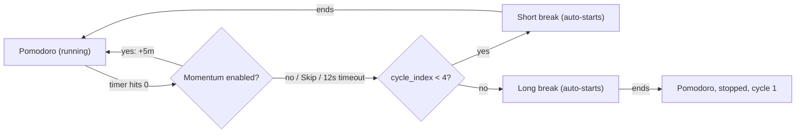

# Pompom Completion Review and Plan

## 1. Application understanding

**Purpose.** pompom is a tiny, frameless, always-on-top Pomodoro timer for the desktop (Windows-first). It shows a red-card widget with a countdown, a play/pause button, and a "Session n / 4" indicator, plus an optional floating task-queue panel. It lives in the system tray with no taskbar button.

**Intended users.** A single user (the author) running it continuously on Windows for personal focus sessions. There is no multi-user, network, or sync dimension.

**Principal workflows.**
- Start/pause a session by clicking the card's play button; ticktock loops while running, a ding plays on completion.
- Automatic cycle: 4 pomodoros with short breaks, then a long break, then stop ([pompom/ui/main_widget.py](pompom/ui/main_widget.py) `_advance_cycle`). Breaks show a cool tint and rotating suggestions ("Stretch", "Hydrate", ...).
- Optional "momentum" offer: when enabled, a finished pomodoro shows "+5m / Skip" buttons for 12 seconds.
- Task queue: add/edit/remove/check-off tasks in a floating panel ([pompom/ui/task_panel.py](pompom/ui/task_panel.py)); the current task's title is shown on the card; sequential or shuffle advance.
- Configuration via a modal Options dialog (durations, momentum, mute, always-on-top, all-virtual-desktops).
- All state persists via QSettings ([pompom/settings.py](pompom/settings.py)); timer mode/remaining/cycle restore on relaunch.

**Apparent design goals.** Minimal visual footprint, deliberate quietness (no taskbar button, no notifications, subtle indicators), and continuous flow (breaks and next sessions auto-start). Commit history shows intentional simplification (e.g. `c60387e "three dot menu removed"`).

**Scope boundaries.** Windows is the real target (virtual-desktop pinning in [pompom/platform/win_desktops.py](pompom/platform/win_desktops.py); non-Windows paths are guarded no-ops). No statistics, no calendar/integration, no notifications system. PyInstaller packaging exists ([pompom.spec](pompom.spec)).

**Assumptions.** (1) Windows-only behaviour is acceptable; (2) the removal of the three-dot menu affordance was deliberate, so it should not be reinstated — discoverability must be solved another way; (3) the non-standard 15-minute default pomodoro is a personal preference, not an oversight.

## 2. Current-state assessment

The application is close to finished. The core loop (start → session → break → cycle → restore on relaunch) is complete and works; the interactions that exist are polished (hover/press states on the play button and momentum zones, elided card title, on-screen clamping after drag/resize, graceful audio degradation, asset-missing paint fallback). Terminal history confirms it runs cleanly with audio.

The few things that most prevent it from feeling finished:

1. **The widget forgets where it was.** Window position, size, and task-panel visibility are not persisted — every launch resets to the 161x96 default at an OS-chosen position. For an always-running desktop widget this is the single biggest "unfinished" signal.
2. **Everything is invisible to a first-time user.** With the three-dot affordance removed, all actions (tasks, options, mute, even Quit) live behind right-click only, with no hint anywhere and no README.
3. **A handful of small clarity gaps**: ambiguous menu labels ("Advance", "Reset"), mute reachable only via Options despite having an on-card indicator, no empty-state in the task panel, free-form resize that can distort the card art (560x96 is allowed).

**Strengths to preserve:** the momentum offer UI (explicit +5m/Skip with countdown in the title), the break tint + rotating suggestions, the multi-row task entry flow (Enter for another line, Esc cancels), the tray behaviour (any click brings the widget to front), the hidden-owner/virtual-desktop windowing work, and the overall restraint of the design.

## 3. Evidence gathered

- [pompom/ui/main_widget.py](pompom/ui/main_widget.py) — full widget: no `move()`/geometry restore in `__init__` (lines 81–84 only `resize(_DEFAULT_W, _DEFAULT_H)`); `_save_state` (261–266) saves tasks/mode/remaining/cycle but no geometry or panel visibility; `populate_action_menu` (397–417) is the entire action surface, reached only via `contextMenuEvent` (663) and tray; resize clamps width/height independently (599–607) allowing distorted aspect ratios; no `keyPressEvent` — zero keyboard support; muted indicator painted at 1004 but no mute action in menus.
- [pompom/ui/task_panel.py](pompom/ui/task_panel.py) — empty list renders as a bare 60px box (no hint, `_refresh_list` 428–445); `TaskItemWidget` title label (254) neither elides nor tooltips long titles; `TaskEditDialog` accepts an empty title (task then displays "(untitled)"); panel is snapped back beside the timer on every timer move (`moveEvent` 315–318 in main_widget), discarding manual placement.
- [pompom/models/tasks.py](pompom/models/tasks.py) — `Task.notes` (line 12) is serialized but has no UI anywhere: a dead field.
- [pompom/ui/options_dialog.py](pompom/ui/options_dialog.py) — well-labelled controls; no indication that duration changes are deferred while the timer runs (deferral logic in `apply_options`, main_widget 121–144).
- [pompom/ui/tray.py](pompom/ui/tray.py) — tray menu rebuilds from `populate_action_menu(include_timer_actions=False)`; any tray click brings the widget to front; static tooltip "pompom".
- [pompom/settings.py](pompom/settings.py) — no keys for geometry or panel visibility; everything else persists.
- [pompom/services/audio.py](pompom/services/audio.py), [pompom/ui/window_utils.py](pompom/ui/window_utils.py), [pompom/platform/win_desktops.py](pompom/platform/win_desktops.py) — robust, deliberate platform work; no product issues.
- [repo_analysis.md](repo_analysis.md) — stale: describes a three-dot menu affordance, "Reset Position", Mute/About menu items, tray "Restart All/Close", and 121x72 default size, none of which match current code. No README exists.
- Git history (`415c41e polishing`, `c60387e three dot menu removed`) and terminal logs (repeated successful launches with FFmpeg audio) — the app runs; menu-affordance removal was intentional. The app was not re-run during this review (plan mode); runtime evidence comes from the user's own recent sessions.

## 4. Recommended completion plan

### Required before completion

**R1. Persist window geometry and task-panel visibility**
- **Finding:** Position, size, and "Show Tasks" state reset on every launch.
- **Evidence:** `PompomWidget.__init__` only calls `resize(_DEFAULT_W, _DEFAULT_H)`; `_save_state` and [pompom/settings.py](pompom/settings.py) have no geometry/panel keys.
- **User impact:** The widget must be re-dragged, re-sized, and the panel re-opened after every restart — the main daily friction for an always-running widget.
- **Desired outcome:** On launch, pompom reappears exactly where and how it was left, with the task panel open if it was open.
- **Likely files:** [pompom/settings.py](pompom/settings.py), [pompom/ui/main_widget.py](pompom/ui/main_widget.py) (`__init__`, `_save_state`).
- **Suggested approach:** Add settings keys (saved geometry, panel-visible flag); restore in `__init__` before `show()`, then let the existing `_ensure_on_screen` clamp handle monitor changes. Save on quit via the existing `_save_state` hook.
- **Priority:** Required. **Estimated scope:** Small.
- **Dependencies:** None; do first — later polish assumes stable geometry.
- **Scope justification:** Completes the existing persistence remit (mode/remaining/cycle/tasks already persist; geometry is the missing piece).
- **Acceptance criteria:** Move/resize widget, open panel, quit, relaunch: same position, size, and panel state. Relaunch after disconnecting a monitor still yields a visible, graspable widget.

**R2. First-run discoverability of the hidden menu (and Quit)**
- **Finding:** All actions are behind right-click with no visible or written hint; a new user cannot find tasks, options, mute, or Quit.
- **Evidence:** `populate_action_menu` is reached only via `contextMenuEvent` and the tray; commit `c60387e` removed the three-dot affordance; no README exists.
- **User impact:** The app appears to be "a timer with one button"; core features are effectively invisible.
- **Desired outcome:** A first-time user learns within seconds that right-click (or the tray) opens the menu, without reintroducing visual clutter.
- **Likely files:** [pompom/ui/main_widget.py](pompom/ui/main_widget.py), [pompom/ui/tray.py](pompom/ui/tray.py), new `README.md`.
- **Suggested approach:** Two cheap, non-intrusive measures: (a) a `setToolTip` on the card and tray icon (e.g. "Right-click for menu"); (b) a short README covering install/run, controls (right-click menu, drag, corner resize), tray behaviour, and settings location. Optionally mention controls in the About box text. Do not restore the three-dot button — that removal was deliberate.
- **Priority:** Required. **Estimated scope:** Small.
- **Dependencies:** None.
- **Scope justification:** Pure discoverability for features that already exist; no new surface area.
- **Acceptance criteria:** Hovering the card or tray icon reveals how to open the menu; README accurately describes every current menu item and interaction.

### High-value finishing work

**H1. Menu label clarity and a reachable mute toggle**
- **Finding:** "Advance" and "Reset" are ambiguous (Advance what? Reset vs Restart Current?); mute has an on-card indicator but can only be toggled deep in Options.
- **Evidence:** `populate_action_menu` (main_widget 397–417); `_draw_muted_indicator` (1004); mute checkbox only in [pompom/ui/options_dialog.py](pompom/ui/options_dialog.py).
- **User impact:** Users hesitate over which action does what; muting mid-meeting takes three clicks through a modal.
- **Desired outcome:** Self-explanatory labels (e.g. "Skip to Break/Session", "Restart Session/Break", "Reset Cycle") and a checkable "Mute" item in both card and tray menus.
- **Likely files:** [pompom/ui/main_widget.py](pompom/ui/main_widget.py) (`populate_action_menu`, reuse `_toggle_mute`).
- **Suggested approach:** Rename actions, optionally making labels mode-aware; add a checkable Mute action; both menus pick it up automatically since they share `populate_action_menu`.
- **Priority:** High-value. **Estimated scope:** Small.
- **Dependencies:** Before README wording is finalised in R2 (README should quote final labels) — or update README in the same batch.
- **Scope justification:** Clarifies existing actions only.
- **Acceptance criteria:** Each menu item's effect is predictable from its label; toggling Mute from either menu updates the card indicator and ticktock immediately.

**H2. Task panel polish: empty state, long titles, edit validation, notes decision**
- **Finding:** Empty queue shows a bare dark box; long titles clip without ellipsis or tooltip; the edit dialog accepts an empty title (task becomes "(untitled)"); `Task.notes` is persisted but has no UI.
- **Evidence:** `_refresh_list` in [pompom/ui/task_panel.py](pompom/ui/task_panel.py); `TaskItemWidget` title label; `TaskEditDialog`; `notes` field in [pompom/models/tasks.py](pompom/models/tasks.py).
- **User impact:** First open of the panel looks broken/unfinished; long tasks are unreadable; accidental empty titles create junk entries.
- **Desired outcome:** An inviting empty state ("No tasks yet — click + Add"), elided titles with full-text tooltips, edit OK disabled (or old title kept) when blank, and a decision on notes: either drop the field from the model/serialisation or surface it (tooltip is enough). Dropping is the simpler, remit-consistent choice.
- **Likely files:** [pompom/ui/task_panel.py](pompom/ui/task_panel.py), [pompom/models/tasks.py](pompom/models/tasks.py).
- **Priority:** High-value. **Estimated scope:** Small–Medium.
- **Dependencies:** None.
- **Scope justification:** Completes interaction states of an existing screen; removes a misleading dead field.
- **Acceptance criteria:** Empty panel explains itself; a 100-character title is elided with a tooltip showing the full text; blank edits cannot erase a title; notes either visible or gone from the model.

**H3. Constrain resize to the card's aspect ratio**
- **Finding:** Width and height clamp independently, so shapes like 560x96 stretch the card PNG badly.
- **Evidence:** `mouseMoveEvent` resize branch (main_widget 599–607); `_draw_card_background` stretches the pixmap to the body rect.
- **User impact:** One careless drag makes the app look broken; there is no way to know the "correct" shape.
- **Desired outcome:** Resizing keeps the card's native proportions (min/max already nearly share a ratio: 161x96 vs 560x328).
- **Likely files:** [pompom/ui/main_widget.py](pompom/ui/main_widget.py) (resize handling).
- **Suggested approach:** Derive height from width (or vice versa) during the resize drag using the card asset's aspect ratio; keep existing min/max bounds.
- **Priority:** High-value. **Estimated scope:** Small.
- **Dependencies:** After R1 so restored geometry is also ratio-correct (normalise once on restore).
- **Scope justification:** Protects the existing visual identity; no redesign.
- **Acceptance criteria:** Any resize drag yields an undistorted card; previously saved odd geometry is normalised on load.

**H4. Minimal keyboard support on the card**
- **Finding:** The card is mouse-only: no key toggles play/pause, and the momentum offer cannot be answered by keyboard.
- **Evidence:** No `keyPressEvent` in [pompom/ui/main_widget.py](pompom/ui/main_widget.py).
- **User impact:** The most frequent action (start/pause) always needs precise mouse targeting; keyboard users are locked out entirely.
- **Desired outcome:** With the widget focused: Space toggles play/pause; during a momentum offer, Enter accepts and Esc skips.
- **Likely files:** [pompom/ui/main_widget.py](pompom/ui/main_widget.py).
- **Suggested approach:** A small `keyPressEvent` mapping onto the existing `_accept_momentum` / `_decline_momentum` / play-toggle logic. Document the keys in the README. (Global hotkeys are out of scope.)
- **Priority:** High-value. **Estimated scope:** Small.
- **Dependencies:** None; mention in README (R2/H1 batch).
- **Scope justification:** Basic accessibility for existing actions; no new features.
- **Acceptance criteria:** Space reliably toggles the timer; Enter/Esc resolve a momentum offer; keys documented.

### Optional or deferrable

**O1. Options dialog deferral feedback** — When durations change while the timer runs, nothing visibly changes until the next session (`apply_options`, main_widget 121–144). Add one static hint line in the dialog ("Applies when the current session ends"). Small; [pompom/ui/options_dialog.py](pompom/ui/options_dialog.py). Acceptance: user changing durations mid-session is told when it takes effect.

**O2. Tray tooltip with live status / session-end balloon** — Tray tooltip is static "pompom"; when muted, a session ending has no audible cue. Optionally set the tooltip to mode + remaining time on tick, and/or `QSystemTrayIcon.showMessage` on transitions (perhaps only when muted). Small–Medium; [pompom/ui/tray.py](pompom/ui/tray.py), [pompom/ui/main_widget.py](pompom/ui/main_widget.py). Deferrable because the always-on-top card already communicates state; balloons may conflict with the app's deliberate quietness.

**O3. Respect manual task-panel placement** — `moveEvent` re-docks the panel beside the timer on every timer move, discarding user placement. Track a user-set offset instead. Small; [pompom/ui/main_widget.py](pompom/ui/main_widget.py). Deferrable: current snap behaviour is predictable and arguably intended.

**O4. Truth-up or retire [repo_analysis.md](repo_analysis.md)** — It describes removed UI (three-dot menu, Reset Position, tray Mute/About) and wrong defaults. Once a README exists, either correct it or delete it to avoid misleading future maintenance. Small. Not user-facing, hence optional.

## 5. Missing states and edge cases

- **First use:** No onboarding context at all — addressed by R2 (tooltips + README). Defaults give a sensible immediate experience otherwise.
- **Empty content:** Task panel has no empty-state message (H2). Card handles the no-task case well (falls back to "pompom" title).
- **Invalid input:** Task edit accepts blank titles (H2). Add-entry already filters blank rows; Options spinboxes already enforce ranges. No other user input exists.
- **Failure states:** Audio and card-asset absence degrade gracefully (audio.py try/except; painted fallback card) — adequate, no user-visible error needed for a personal tool. No network use, so no network states required.
- **Success/completion:** Session end has ding + visual change; when muted there is no cue if the card is out of eyeshot (O2). All-tasks-done simply clears the current task — acceptable.
- **Destructive actions:** "Delete completed tasks" and task remove have no undo/confirm; low stakes (short text entries), acceptable to leave. Quit saves state via `aboutToQuit`, so no confirmation needed.
- **Recovery:** Off-screen recovery already exists (`_ensure_on_screen`, `_clamp_to_screen`). Crash recovery loses at most the current session — acceptable.
- **Long content:** Card title elides correctly; panel titles do not (H2).
- **Responsive behaviour:** N/A as web-responsive, but resize distortion (H3) and multi-monitor/geometry restore (R1) are the desktop equivalents.
- **Keyboard/accessibility:** No keyboard path to any card action (H4); task panel widgets are standard Qt controls and already tabbable.
- Hypothetical cases deliberately excluded: locale/i18n, screen-reader support for the painted card, Wayland/macOS behaviour — outside the app's evident personal-Windows remit.

## 6. Areas that should remain unchanged

- **Momentum offer interaction** (+5m / Skip buttons with countdown in the title, hover/press feedback) — recently refined, clear, and complete.
- **Break presentation** (teal/blue tint + rotating suggestions) — communicates mode at a glance without noise; randomising suggestion order would add nothing.
- **Multi-row task entry** (Enter adds a row, Esc cancels, explicit Done/Cancel with a hint label) — an unusually good micro-interaction; leave as is.
- **Auto-flow of the cycle** (breaks and next sessions auto-start; stop after long break) — a deliberate flow decision; making it configurable is scope creep.
- **Tray minimalism and click-to-front** — any tray click recovers a buried widget; simple and reliable.
- **Windowing/platform layer** ([pompom/ui/window_utils.py](pompom/ui/window_utils.py), [pompom/platform/win_desktops.py](pompom/platform/win_desktops.py)) — hard-won, well-documented solutions to genuinely awkward Windows constraints; do not touch.
- **QSettings persistence model and 15-minute default** — working pattern and personal preference respectively.
- **Absence of the three-dot menu button** — its removal was a deliberate simplification; solve discoverability with hints, not by reverting.

## 7. Proposed implementation sequence

**Batch 1 — Session persistence (R1).** Areas: settings.py, main_widget.py. Outcome: widget and panel come back exactly as left. Acceptance: quit/relaunch round-trips geometry and panel visibility; off-screen positions are clamped.

**Batch 2 — Actions and labels (H1 + H4).** Areas: main_widget.py (menu, keys). Outcome: unambiguous menu, mute reachable from both menus, Space/Enter/Esc work. Acceptance: both menus show identical clear labels; mute toggles from menu update indicator and sound; keys behave as specified.

**Batch 3 — Task panel polish (H2).** Areas: task_panel.py, models/tasks.py. Outcome: empty state, readable long titles, no blank-title edits, notes field resolved. Acceptance: as listed in H2.

**Batch 4 — Card resize integrity (H3).** Areas: main_widget.py. Outcome: card cannot be distorted. Acceptance: all reachable sizes preserve the asset's aspect ratio, including restored geometry from Batch 1.

**Batch 5 — Discoverability and docs (R2, finalised last so it documents the final UI; optionally O4).** Areas: tooltips in main_widget.py/tray.py, new README.md, repo_analysis.md. Outcome: a newcomer can operate every feature from the README or tooltips alone. Acceptance: README matches shipped labels/keys exactly; tooltips present on card and tray.

**Batch 6 (optional) — Quiet-mode feedback (O1, O2, O3).** Only if desired after using Batches 1–5; each item independently shippable.

## 8. Validation plan

Manual review on Windows, running from source (`python -m pompom`) and once via the PyInstaller build (asset paths differ under `sys._MEIPASS`):

- **Core journeys:** full 4-session cycle with short and long breaks (temporarily set 1-minute durations via Options); momentum enabled: accept once, skip once, let one expire; task lifecycle: add several (multi-row), edit, mark done during a session, verify auto-advance at session end, delete completed.
- **Persistence:** move/resize widget, open panel, add tasks, quit from menu; relaunch and confirm geometry, panel, tasks, mode, remaining time, cycle index. Repeat once after changing display scaling or monitor layout to confirm clamping.
- **States:** empty task panel message; 100+ character task title on card and panel; blank edit rejected; mute from each menu (indicator appears, ticktock stops); muted session end still visually announced; Options change while running shows deferral behaviour.
- **Interaction/keyboard:** Space toggle with widget focused; Enter/Esc during momentum; drag to each screen edge and confirm the 48px grasp margin; corner resize to min and max confirming no distortion; right-click menu and tray menu equivalence.
- **Regression checks on preserved behaviour:** tray click brings widget to front when buried; always-on-top and all-desktops toggles still apply live from Options; painted fallback still renders if `images/red-card.png` is renamed away; app still runs (silently) if QtMultimedia is unavailable.
