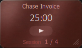
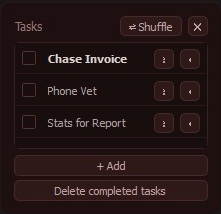

# pompom

A small always-on-top Pomodoro timer for Windows. A floating red card shows the countdown; an optional task panel tracks what you are working on. The app lives in the system tray with no taskbar button.

## Install

1. Open the [latest GitHub release](https://github.com/ldbiz/pompom/releases/latest).
2. Download **pompom-1.0.0-setup.exe**.
3. Run the installer. Installation is per-user and does not need administrator access.

If Windows SmartScreen says Windows protected your PC, click **More info**, then **Run anyway**. The installer is not code-signed, so this warning is expected.

After setup, pompom is in the Start Menu. The installer can also add a desktop shortcut or start pompom with Windows.

## Pomodoro cycle

Four sessions (default 25 min each) with short breaks (5 min), then a long break (30 min). Breaks and the next session start automatically. After the long break the timer stops at session 1.

Each app launch starts a fresh timer at session 1, stopped. Tasks, options, window geometry, and task-panel visibility persist between launches.

## Card controls

| Action | How |
| --- | --- |
| Start / pause | Click the play button, or press **Space** (card focused) |
| Open menu | **Right-click**, **Menu**, or **Shift+F10** |
| Toggle mute | Press **M** |
| Show / hide tasks | Press **T** |
| Move | Drag anywhere except the play button or resize corner |
| Resize | Drag the bottom-right corner (aspect ratio is preserved) |

During a **momentum** offer (when enabled in Options): click **+5m** or **Skip**, or press **Enter** / **Esc**.

## Right-click menu (card)

When in a **session**:

- **Skip to Break** — end the current session and start the break
- **Restart Session** — restart the current session from the beginning
- **Reset Cycle** — return to session 1, stopped

When in a **break**:

- **Skip to Session** — end the break and start the next session
- **Restart Break** — restart the current break from the beginning
- **Reset Cycle** — return to session 1, stopped

Always available:

- **Mark Task as Done** — check off the current task and advance (disabled when no current task)
- **Show Tasks** / **Hide Tasks** — toggle the task panel
- **Mute** — silence ticking and the completion bell
- **Options…** — durations, sound, momentum, window behaviour, virtual desktops, and Start with Windows
- **Quit** — save state and exit

## System tray

- **Left-click** or **right-click** the tray icon to bring the card to the front.
- **Right-click** the tray icon for the same menu as the card (without the timer skip/restart actions).
- Hover the tray icon to see the current mode, time remaining, and running/paused state.

## Task panel

Open via **Show Tasks** in the menu. Add tasks with **+ Add** (Enter for another line, Esc to cancel). Drag the panel to place it; it stays where you put it until you close it.

## License

The application code is available under the [MIT License](LICENSE).
